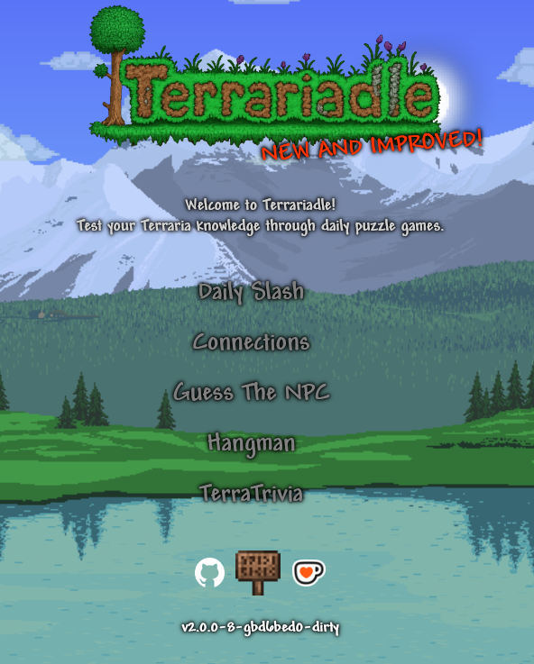

# Terrariadle_2.0

[Live Site](#terrariadle.com) - [Report a Bug](#mailto:terrariadle@gmail.com) - [Reach Out](#mailto:terrariadle@gmail.com) - [Support Me](#)

---

<!--  -->


---

Welcome to Terrariadle! This is a passion project based on the best game ever, [Terraria](https://terraria.org/). I'm a solo developer that loved playing daily games such as [Wordle](https://www.nytimes.com/games/wordle/index.html), [Loldle](https://loldle.net/), [Connections](https://www.nytimes.com/games/connections), and [Crossword](https://puzzles.usatoday.com/). I wanted to make a version of these daily puzzles based on my all-time favorite game.

This project aims to remake another developer's project: [Terradle](https://www.terradle.com/). They did an amazing job on his site, but I wanted to expand and improve on the idea.

This site contains 5 different daily puzzles:

- **Daily Slash** — Wordle type game based on Terraria's weapons
- **Connections** — Terraria themed Connections game
- **Guess the NPC** — Use the quote to guess the NPC
- **Hangman** — Guess the enemy one letter at a time
- **TerraTrivia** — Terraria themed Seven Little Words

If your curious on how I made this project, or some of the design choices behind it, I encourage you to look into the [docs](./docs/) folder. I wrote a ton about my development throughout this rewrite and I hope my struggles can help you make your own project.

## Why I built this

Terraria is one of my all-time favorite games. I've put over 2,000 hours into the base game and another 500 into modded. I started playing back when Ocram was still a boss on the mobile version. Alongside Terraria, I've always been hooked on daily puzzle games. I would play games like Wordle, Connections, Loldle, the USA Today crossword during my courses.

A year out of school, I wanted a project that was bigger than a simple class assignment. While struggling to come up with something meaningful, it clicked that no one had made a proper daily puzzle game for Terraria. I decided to fill this gap and make a daily puzzle game, **Terrariadle**.

The goal of Terrariadle was not only to provide a fun puzzle game that gave back to the Terraria community, I wanted it to be a project that I owned. A project where I chose the architecture. It's the largest application I've built end-to-end, spanning over full-stack development and infrastructure. It's also a project I could be passionate about, encouraging me to update and rebuild the codebase until it felt right.

I'm happy to share this site with you, and I hope it's useful if you're learning Svelte. It's still a relatively under-utilized framework, so feel free to dig through the code as a reference for your own projects.

## History Behind this Game

This repository is actually a remake of the first iteration of the game. If you've been playing before this release, I made the first version in college with little knowledge on full-stack development and deployment. While I learned a lot, version 1.0 was the definition of MVP.

My backend was in `Node.js`, and was a combination of 2 JavaScript files. My frontend was built in `React`, with no experience in any frontend framework beforehand. The site was extremely buggy, always crashing, and throwing constant errors about rendering images. I've included some parts of my old project files in [Legacy Notes](./docs/legacy-notes/). I recommend looking if you want to know what not to do.

After restarting my server constantly and taking a break from developing for a couple of months, I decided that this project needed a massive overhaul. I decided to ditch my stack in place for modern languages. I did a ton of research into different options for my stack, until I came across `Svelte` and `Go`. These two quickly became my favorite due to their speed and simplicity. I then spent 9 months learning and refactoring the entire app, which has led us to where we are today.

## Tech Stack

| Layer                      | Tech          |
| -------------------------- | ------------- |
| Frontend                   | SvelteKit     |
| Backend                    | Go            |
| Database                   | MongoDB Atlas |
| Web Server / Reverse Proxy | Caddy         |
| Hosting                    | Oracle Cloud  |

I chose this stack because of its simplicity and speed. Sveltekit was easy to learn, and compiles down to HTML/JS. Go is known for its lightweight procedural design and amazing standard library, making things like concurrency and error handling very easy. Caddy makes reverse-proxies super easy and has automatic certificate renewals. Throughout this stack, I wanted to prioritize readability, reliability, and efficiency. I went into details about technical decisions and their upsides/downsides in [choosing my stack](docs/choosing-my-stack.md).

This project is a culmination of my efforts to making the project the best it can be. I intentionally avoided AI-driven development tools, opting to get my hands dirty and learn as much as possible. While I did use AI to work through Go and Svelte documentation and as a sounding board for ideas, the large majority of the code was written by me. This hands-on approach is what taught me so much about system design, language architecture, and process flow.

## File Structure

```
Terrariadle/
├── docs/       # Dev notes, technical documents, diagrams
├── internal/   # Go packages and services - see docs/architecture/backend
├── frontend/   # SvelteKit pages - see docs/architecture/frontend
├── go.mod
├── go.sum
├── Makefile
└── main.go
```

## Roadmap / What's Next

While I talk a lot about this being a finished product, I'm still in the process of building out extra features in the game. Here are a few of the additions I plan on making in the game:

- Improved UI for winning cards in `Connections`, `Hangman`, and `TerraTrivia`
- Improved UI and animations for word chunk options in `TerraTrivia`
- Added loading animation for pages
- Total user guess count on landing page
- Overhaul of category options for `Connections`
- Custom Terraria cursor

Here are the extras I'm planning on adding to the backend:

- Logging on the backend
- Outside monitoring with automatic app restart if it breaks
- Add custom way to reach out for feedback or bugs
- Better way of tracking what I'm working on (probably GitHub)

More information on what I'm adding can currently be found in `/docs/Todo.md`.

## License

This project is licensed under the MIT License - see the [LICENSE](LICENSE) file for details.

_Terrariadle is a fan project and is not affiliated with Re-Logic or the official Terraria game._
