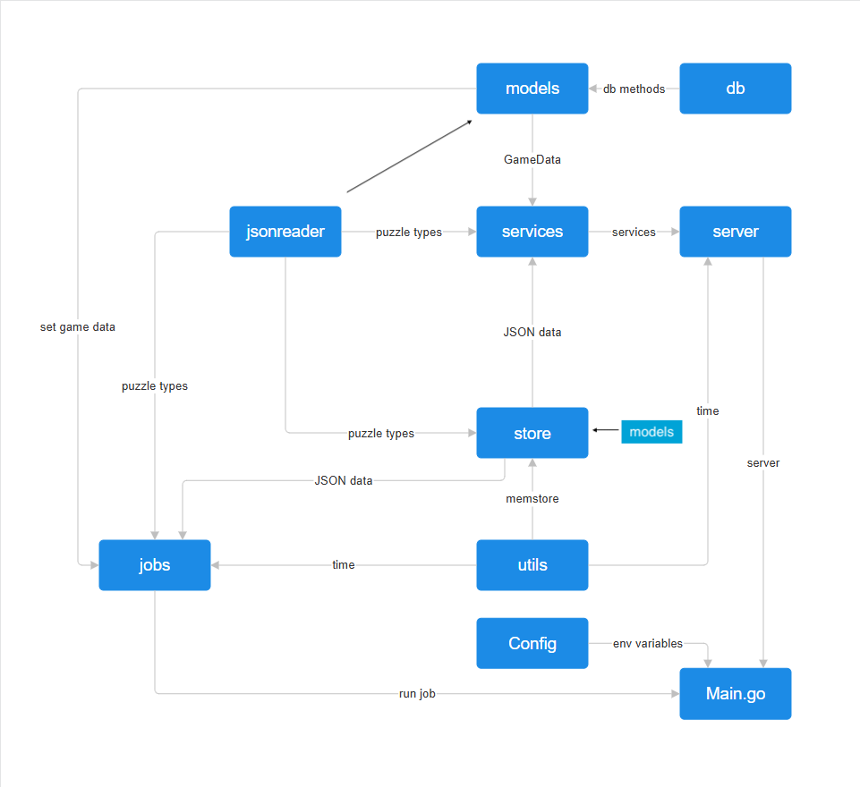
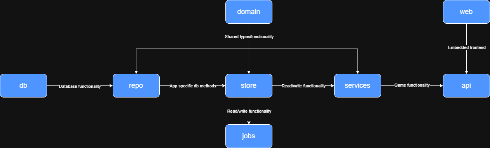

# Managing Package Dependencies: A Learning Journey

This doc walks through how the package structure for Terrariadle's Go backend evolved — not just the "after" picture, but the reasoning that got us there. The goal is to save future contributors (including future me) the trial and error.

## The Starting Point

Early on, the backend was organized loosely around _what things were_ rather than _what they did_: `models`, `jsonreader`, `server`, `store`, `utils`, `jobs`, `db`, `config`.



A few things stand out looking back at this graph:

- **`server` was a dumping ground.** It held handlers, services, and routing all in one package. Any change to business logic risked touching HTTP concerns, and vice versa.
- **`models` mixed two unrelated responsibilities.** It defined the core game data types _and_ pulled in DB methods from `db`. That meant a package meant to describe "what a puzzle is" also knew how to persist one.
- **Dependencies criss-crossed instead of flowing one direction.** `jobs` reached into `jsonreader`, `store`, and `utils`; `main.go` reached back into `jobs`. There was no consistent "this always depends on that" rule, which made it hard to reason about what would break if something changed.
- **No clear bottom layer.** Nothing played the role of a dependency-free set of shared types — every package assumed knowledge of some other package's internals.

## Working Through It

The refactor happened in a few discrete passes rather than one rewrite:

### 1. Establishing general rules first

Before touching code, the first step was pinning down general principles for Go package organization:

- **Organize by purpose, not by type.** A `user` package with its type, validation, and queries beats a `models` package holding every struct in the app.
- **Prefer flat over deeply nested.** Go's standard library rarely nests more than one or two levels deep.
- **No circular imports, and ideally a one-directional dependency graph.** Draw an arrow from every package to what it imports — the result should be a DAG.
- **`internal/` for anything not meant to be imported outside the module.**
- **A package should have one reason to change.** If describing what it does requires an "and," it's doing too much.

### 2. Splitting `server` into `handlers` and `services`

The biggest structural problem was `server` doing everything. The fix was separating **HTTP concerns** from **business logic**:

- `handlers` owns request parsing, response encoding, route registration, and middleware — it knows about HTTP, nothing about how a guess is actually evaluated.
- `services` owns domain operations like evaluating a guess — it has no awareness that HTTP exists at all.

Each handler co-locates its own `RegisterRoutes` method rather than centralizing routes in one file, since each game mode (DailySlash, Connections, GuessTheNpc, Hangman) is already a self-contained domain. At this project's scale, per-file route registration was more practical than a single `routes.go`.

### 3. Clarifying what a package actually _is_ in Go

A couple of mechanical misunderstandings had to get sorted out along the way:

- A single package **cannot** span multiple folders — every folder is its own package. If one logical package (like `repo`) is getting large, the options are: multiple files in the same directory (the idiomatic default), splitting into genuinely separate packages, or using filename prefixes for grouping.
- Having 10+ files in one package is completely normal — `net/http` does it. File count alone isn't a signal to split.

### 4. Deciding where scheduling logic lives

A smaller but representative example: where should a "flush dirty users to the DB every 30 seconds" job live — `store` or `jobs`?

The resolution: **`store` owns the operation** (`FlushDirty` needs direct access to the store's internal state), and **`jobs` owns the schedule** (the ticker loop that decides _when_ to call it). This is the same "knows how" vs. "knows when" split that later justified separating `handlers` from `services`.

### 5. Introducing a real bottom layer: `domain`

The old graph had no package that was purely types and interfaces with zero outgoing dependencies. The new structure introduces `domain` for exactly that — it sits at the bottom, and nearly everything else imports it. That's intentional: a `domain` package is _supposed_ to be imported everywhere, since its whole job is to be the shared vocabulary the rest of the app is built on. Defining repository/service interfaces here also decouples layers and makes mocking straightforward for tests.

## The Result



The new graph reads left-to-right / top-to-bottom as a single flow:

```
domain → repo → store → services → api
           ↑        ↓
           db      jobs
```

- **`domain`** — shared types and interfaces, no dependencies of its own.
- **`db`** — raw database functionality.
- **`repo`** — app-specific DB methods built on top of `db`.
- **`store`** — read/write functionality built on `repo`, also feeds `jobs`.
- **`services`** — game functionality built on `store`.
- **`api`** — HTTP layer, consumes `services`, embeds the `web` frontend.

Compared to the old diagram, every arrow now points in one direction. There's no package reaching "backward" into something that depends on it, and each package's role can be described in a single sentence.

## Takeaways

1. **Organize around responsibility, not convenience.** `models` and `server` grew into dumping grounds precisely because they were named after a category ("things that are data," "the server stuff") rather than a job.
2. **A dependency graph should be drawable as a DAG.** If you can't point every arrow in one consistent direction, that's a sign the boundaries are wrong, not that the graph is just "complicated."
3. **"Knows how" vs. "knows when"** is a useful split for more than just jobs — it's the same logic that separates `handlers` from `services`.
4. **A dependency-free `domain` layer is worth having early.** Retrofitting one is more disruptive than starting with it, since everything downstream ends up needing to import it.
